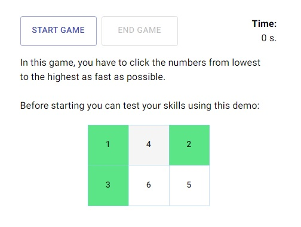

The <strong>Mind Improvement Games</strong> project was created to improve the speed of thinking, both for the the myself as a developer and the future players.

It was created using React, Material-UI, Styled Components and plain JavaScript.

## Deployment

http://mindgames.jadach.net

## Games:
###  `Fast Counting`

###  `Order Numbers`

## Available Scripts

In the project directory, you can run:

### `npm install`

Installs all the nessesary npm pacakges to develop or run the project.

### `npm run dev`

Runs the app in the development mode. 
Open [http://localhost:3000](http://localhost:3000) to view it in the browser.

The page will reload if you make edits. 
You will also see any lint errors in the console.

### `npm run build`

Builds the app for production to the `build` folder. 
It correctly bundles React in production mode and optimizes the build for the best performance.

The build is minified and the filenames include the hashes. 

